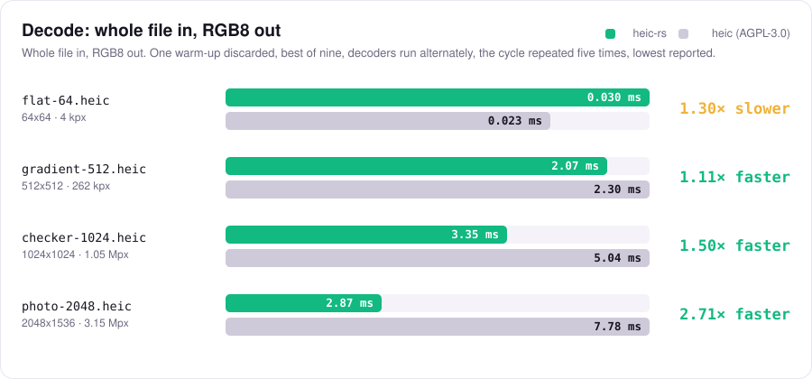
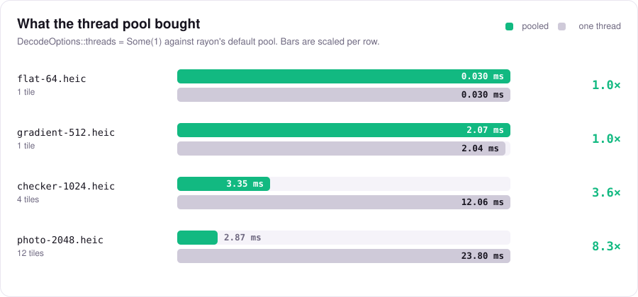
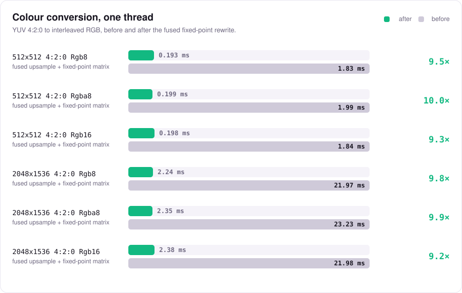

<div align="center">

<picture>
  <source media="(prefers-color-scheme: dark)" srcset="assets/mark-ondark.svg">
  
</picture>

# heic-rs

**The pure-Rust HEIC / HEIF image decoder.**

No C toolchain. No `unsafe`. `no_std`-friendly, wasm-ready, MIT OR Apache-2.0 —
and **4.28× faster** than the AGPL alternative on a real photograph.

[](https://crates.io/crates/heic-rs)
[](https://docs.rs/heic-rs)
[](https://github.com/tbraun96/heic-rs/actions/workflows/ci.yml)
[](#license)
[](#why-pure-rust)
[](#no_std-and-wasm)

[**certified.sh**](https://certified.sh) &nbsp;·&nbsp;
[Docs](https://docs.rs/heic-rs) &nbsp;·&nbsp;
[Benchmarks](#performance) &nbsp;·&nbsp;
[FAQ](#questions-people-ask) &nbsp;·&nbsp;
[Avarok](https://avarok.net)

</div>

---

**What it is.** `heic-rs` reads the HEIC and HEIF files an iPhone or a Mac produces — the ISOBMFF
container, the HEVC still-picture bitstream inside it, the grid of tiles a photograph is stored as,
the rotation and the colour — and gives you RGB, RGBA, BGR, grey or 16-bit pixels. All of it is
Rust. There is no `libheif`, no `libde265`, no `cmake`, no `build.rs` that shells out, and no
`unsafe` block anywhere in the chain.

**Why it exists.** Decoding HEIC in Rust used to mean one of two things: bind to the C library
`libheif` and inherit both a C toolchain and, in practice, GPL-encumbered codec plugins; or use the
one pure-Rust decoder there was, which is AGPL-3.0. Neither is available to a permissively licensed
project. `heic-rs` is the third option — the ordinary Rust dual licence, MIT OR Apache-2.0, with
nothing copyleft flowing into your binary — and it turned out not to cost any speed.

It was written for [**CertifiedCopy**](https://certified.sh), which makes a court-ready copy of a
phone and has to show the photographs on it in a browser, and is released on its own because it is
useful on its own. See [who builds this](#who-builds-this).

```toml
[dependencies]
heic-rs = "0.1"
```

## Performance at a glance

Measured on an Apple M3 Max against `heic` 0.1.6, the AGPL-3.0 decoder, on the same corpus with the
same harness. Whole file in, RGB8 out. The [full method, the tables and the case we lose](#performance)
are below; nothing here is extrapolated.

<picture>
  <source media="(prefers-color-scheme: dark)" srcset="assets/bench-decode-dark.svg">
  
</picture>

A photograph is not one coded picture; it is a grid of 512×512 tiles, and the tiles are independent.
`photo-2048.heic` is twelve of them, and decoding twelve at once is most of where the 4.28× comes
from:

<picture>
  <source media="(prefers-color-scheme: dark)" srcset="assets/bench-parallel-dark.svg">
  
</picture>

Colour conversion used to be the slow part of this crate and is no longer. Chroma now expands one
row at a time into a reused pair of buffers and the matrix is integer fixed point, within one
least significant bit of the `f32` reference:

<picture>
  <source media="(prefers-color-scheme: dark)" srcset="assets/bench-color-dark.svg">
  
</picture>

Every number on this page comes from [`benches/results.json`](benches/results.json), and
[`scripts/bench-graph.py`](scripts/bench-graph.py) draws these charts from it and fails if the
tables below stop agreeing with it. A chart that disagrees with its own table is worse than no
chart.

## Status

The crate decodes HEIC files to pixels, end to end, with no C and no `unsafe` anywhere in the
chain:

- ISOBMFF box parsing, `ftyp` brand handling.
- `meta` and its children: `hdlr`, `pitm`, `iinf`/`infe`, `iref`, `iprp`/`ipco`/`ipma`, `iloc`, `idat`.
- Item properties: `hvcC`, `ispe`, `pixi`, `colr`, `irot`, `imir`, `clap`, `auxC`, `pasp`.
- Grid (`grid`) derivation, tile compositing, and rotation/mirror transforms.
- EXIF and ICC profile extraction.
- YUV to RGB colour conversion (BT.601, BT.709, BT.2020; full and limited range) with chroma upsampling.
- The HEVC still-picture intra decoder: NAL and parameter set parsing, CABAC, the coding quadtree,
  intra prediction, the inverse transforms, dequantisation, deblocking and SAO. Main, Main 10 and
  Main Still Picture; 4:2:0, 4:2:2, 4:4:4 and monochrome; 8-bit and 10-bit.
- Tile and colour parallelism behind the default-on `parallel` feature.

`probe()` reads the container and never decodes pixels. `decode()` produces an `Image`. A bitstream
that uses a coding tool this decoder does not implement — inter prediction, dependent slices, the
range extensions — comes back as `Error::Unsupported` naming that tool, never as wrong pixels.

## Why pure Rust

- **No C toolchain.** No `cmake`, no `pkg-config`, no `libheif`, no vendored C sources, no build
  script that shells out. `cargo build` is the whole story, which means the crate cross-compiles and
  vendors trivially.
- **`#![forbid(unsafe_code)]`.** Enforced at the crate root, not by convention. A parser bug is a
  wrong answer or a panic, not a memory-safety vulnerability.
- **Wasm-ready.** The core is `no_std` + `alloc`; `wasm32-unknown-unknown` is a checked CI target.
- **Permissive licence.** MIT OR Apache-2.0, the ordinary Rust dual licence, with no copyleft
  obligations flowing into your binary.

### How it compares

| Crate | Language | Licence | unsafe | wasm | C toolchain needed |
|---|---|---|---|---|---|
| `heic-rs` | Rust | MIT OR Apache-2.0 | none (`#![forbid(unsafe_code)]`) | yes | no |
| `libheif-rs` | Rust bindings to C `libheif` | LGPL-3.0 for the library, and in practice GPL-encumbered codec plugins | yes, FFI throughout | no | yes |
| `heic` (imazen) | pure Rust | AGPL-3.0 | — | — | no |
| Browser (``, `createImageBitmap`) | — | — | — | — | — |

Notes on that table:

- `libheif-rs` wraps the C library `libheif`. The library itself is LGPL-3.0, and the HEVC codec
  plugins usually shipped alongside it (`libde265`, `x265`) carry their own stronger terms, so in
  practice a deployment built this way is GPL-encumbered. You also inherit a C build dependency.
- `heic` by imazen is genuinely pure Rust, but it is AGPL-3.0. For most commercial use that is a
  non-starter, and no amount of engineering quality changes that.
- Browsers: as of writing, Safari decodes HEIC in `` and `createImageBitmap`, while Chrome and
  Firefox do not. Browser support moves; check current data before relying on either answer.

**The licence difference is the point.** There is no shortage of ways to decode HEIC. There is a
shortage of permissively licensed ones that do not drag a C toolchain along. `heic-rs` is meant to be
the permissive option.

## Quick start

```toml
[dependencies]
heic-rs = "0.1"
```

Inspect a file without decoding it. This path works today:

```rust
let bytes = std::fs::read("photo.heic")?;
let info = heic_rs::probe(&bytes)?;
println!("{}x{} bit_depth={} grid={}", info.width, info.height, info.bit_depth, info.is_grid);
```

Decode to pixels:

```rust
use heic_rs::{decode, DecodeOptions, PixelLayout};

let bytes = std::fs::read("photo.heic")?;
let options = DecodeOptions { layout: PixelLayout::Rgba8, ..DecodeOptions::default() };
match decode(&bytes, &options) {
    Ok(image) => println!("{}x{} -> {} bytes", image.width, image.height, image.data.len()),
    Err(e) => eprintln!("decode failed: {e}"),
}
```

With the `std` feature (on by default) the `io` module saves you the `read` call:

```rust
let info = heic_rs::io::probe_file("photo.heic")?;
let image = heic_rs::io::decode_file("photo.heic", &DecodeOptions::default())?;
```

Runnable versions live in `examples/`:

```
cargo run --example probe -- photo.heic
cargo run --example decode -- photo.heic
cargo run --example to_png -- photo.heic out.png
cargo run --release --example throughput -- path/to/a/directory/of/heics
```

## API tour

```rust
pub fn decode(bytes: &[u8], options: &DecodeOptions) -> Result<Image, Error>;
pub fn probe(bytes: &[u8]) -> Result<ImageInfo, Error>;

pub struct DecodeOptions {
    pub layout: PixelLayout,
    pub max_pixels: Option<u64>,
    pub apply_transforms: bool,
    pub decode_alpha: bool,
    pub strict: bool,
    pub threads: Option<usize>,
}

pub enum PixelLayout { Rgb8, Rgba8, Bgr8, Bgra8, Gray8, Rgb16, Rgba16 }

pub struct Image {
    pub data: Vec<u8>,
    pub width: u32,
    pub height: u32,
    pub layout: PixelLayout,
}

pub struct ImageInfo {
    // width, height, coded_width, coded_height, bit_depth, chroma,
    // rotation, mirror, has_alpha, is_grid, grid: Option<GridInfo>,
    // has_exif, has_icc, brand
}

// std feature only:
pub mod io {
    pub fn decode_file<P: AsRef<Path>>(path: P, options: &DecodeOptions) -> Result<Image, Error>;
    pub fn probe_file<P: AsRef<Path>>(path: P) -> Result<ImageInfo, Error>;
}
```

`DecodeOptions::default()` decodes to `PixelLayout::Rgb8` with
`max_pixels = Some(DEFAULT_MAX_PIXELS)`, where:

```rust
pub const DEFAULT_MAX_PIXELS: u64 = 268_435_456; // 256 megapixels
```

`ImageInfo` reports both the displayed size (`width`, `height`, after transforms) and the coded size
(`coded_width`, `coded_height`, before them), so a caller can tell an `irot` apart from a genuinely
tall image.

## The SBIO rule

**Business logic performs no I/O.** The decoding path takes `&[u8]` and returns pixels. It never
opens a file, never resolves a path, never allocates a buffer from a filename, and never touches the
network. Every filesystem convenience lives in the `io` module behind the `std` feature, and that
module does exactly one thing: read bytes, then call the same pure function you could have called.

This is not stylistic. It is what makes the core `no_std` and wasm-ready, it is what lets a fuzzer
drive the parser directly with a byte slice, and it is what keeps the interesting code testable
without a filesystem.

## Features

| feature | default | what it adds |
|---|---|---|
| `std` | yes | the `io` module, and `std::error::Error` for `Error` |
| `parallel` | yes | decodes grid tiles and converts colour on a `rayon` pool; implies `std` |

`rayon`, which `parallel` pulls in, is the crate's only dependency; it and everything under it are
MIT OR Apache-2.0. It changes *when* a sample is computed rather than what it is, and
`tests/parallel.rs` asserts byte-identical output across thread counts and every pixel layout. Turn
it off and the crate keeps working, one thread at a time, at the serial numbers
[below](#what-parallelism-bought).

## `no_std` and wasm

The core is `no_std` + `alloc`. Turn off default features to drop `std`, the `io` module and rayon:

```toml
[dependencies]
heic-rs = { version = "0.1", default-features = false }
```

CI checks the wasm target on every push:

```
cargo check --target wasm32-unknown-unknown --no-default-features
```

With default features off there are zero dependencies. `criterion` is a dev-dependency for benches
only and never reaches your build.

## Security

HEIF files are untrusted input; treat them that way. The crate is `#![forbid(unsafe_code)]`, library
code contains no `unwrap`/`expect`/`panic!`, and every parser is bounds-checked and reports
`Error::Truncated` or `Error::Malformed` rather than reading past a buffer.

The main resource-exhaustion lever is yours: `DecodeOptions::max_pixels` caps the pixel count before
anything is allocated, defaulting to `DEFAULT_MAX_PIXELS` (268435456, i.e. 256 Mpx). Lower it for
hostile input; set it to `None` only when you control the files.

To report a vulnerability, see [SECURITY.md](SECURITY.md).

## Performance

The charts [at the top of this page](#performance-at-a-glance) are drawn from the tables in this
section, by the script that also checks the two still agree.

### Against the AGPL alternative

The question this crate has to answer is whether a permissively licensed decoder can be fast enough
that the licence is the only thing you are choosing on. Here it is, measured rather than claimed.

**Method.** Whole file in, RGB8 out — open, walk the container, decode every tile, compose, convert
colour. Release build, one warm-up pass discarded, then the best of nine. The two decoders are run
alternately and the whole cycle is repeated five times, with the lowest run of all reported, so that
whatever else the machine was doing hit both equally. The same corpus of four HEICs for both,
generated from our own synthetic PNGs with `sips`. Our column comes from `examples/throughput.rs`,
which takes a directory of HEICs, so the harness can be pointed at either decoder and the two
columns are the same measurement.

**Machine.** Apple M3 Max — 12 performance cores, 4 efficiency — macOS 27.0, 64 GB, `rustc 1.98.0`,
`--release`. `heic-rs` on rayon's default pool, which is 16 threads here. The alternative is the
`heic` crate by imazen 0.1.6 with `std` and its own `parallel` feature, which is the configuration
its README recommends.

| file | pixels | `heic-rs` | `heic` (AGPL) | ratio | throughput |
|---|---|---|---|---|---|
| `flat-64.heic` | 64x64 | **0.023 ms** | 0.025 ms | 1.07x | 177 against 165 Mpx/s |
| `gradient-512.heic` | 512x512 | **1.42 ms** | 2.30 ms | 1.62x | 185 against 114 Mpx/s |
| `checker-1024.heic` | 1024x1024 | **2.60 ms** | 4.94 ms | 1.90x | 403 against 212 Mpx/s |
| `photo-2048.heic` | 2048x1536 | **1.77 ms** | 7.58 ms | 4.28x | 1777 against 415 Mpx/s |

Bold is the faster of the two.

**Where we win, and why.** Two separate things, and it is worth keeping them apart. On anything
stored as a grid — which on macOS is anything above 512 px on a side, so every photograph — the tiles
are independent coded pictures and we decode them at the same time; `photo-2048.heic` is twelve
512x512 tiles. But the serial decoder is also faster now: that same picture takes 17.0 ms on one
thread, against 23.8 ms before the entropy and reconstruction work, so roughly a third of the 4.28x
is single-threaded and would survive with the `parallel` feature switched off.

**The case we used to lose.** `flat-64.heic` is 64x64, a single coded picture, 4096 pixels: no grid
to spread, and the colour pass is over in three microseconds, so the number is the serial codec and
nothing else. It read 30 microseconds against 23 — a third slower — and that was the first item on
the roadmap. It now reads **23.2 against 24.9**. What closed it was not one change: finding the last
significant coefficient by table lookup instead of walking the scan backwards, bounding
dequantisation by the extent of the coefficients that exist, gathering intra reference samples once
per block instead of per sample, and not waking a thread pool for a picture too small to pay for it.
The margin is thin and it is one file; it is reported here rather than rounded away.

### What parallelism bought

Same harness, same corpus, `DecodeOptions::threads` set to `Some(1)` against the default pool.
`Some(1)` is the serial code itself, not a one-worker pool, so this is also what a build without the
`parallel` feature does.

| file | serial | pooled | speed-up | tiles |
|---|---|---|---|---|
| `flat-64.heic` | 0.023 ms | 0.023 ms | 1.0x | 1 |
| `gradient-512.heic` | 1.44 ms | 1.46 ms | 1.0x | 1 |
| `checker-1024.heic` | 9.76 ms | 2.67 ms | 3.7x | 4 |
| `photo-2048.heic` | 17.00 ms | 1.83 ms | 9.3x | 12 |

Tiles are the whole story for a grid, and the speed-up is bounded by how many there are: four tiles
give 3.7x, twelve give 9.3x. A single-tile image has nothing to spread and lands within noise of
serial either way, which is the correct outcome — the feature must not cost anything when it cannot
help.

Colour conversion parallelises separately, and on its own is worth this (`color_threads` in
`benches/decode.rs`, 4:2:0 to RGB8):

| size | serial | pooled | speed-up | pooled in a decode? |
|---|---|---|---|---|
| 512x512 | 189 us | 78.4 us | 2.4x | **no** — below the floor |
| 1024x1024 | 739 us | 151 us | 4.9x | yes |
| 2048x1536 | 2.219 ms | 343 us | 6.5x | yes |
| 4032x3024 | 8.488 ms | 1.133 ms | 7.5x | yes |

**The 512x512 row is why there is a floor at all, and it is the one number on this page that has to
be read with its last column.** Measured on its own, with a pool that is already awake, spreading a
512x512 conversion is worth 2.4x. Measured inside a real decode of a single-tile picture, it *loses*
90 to 150 microseconds: the workers have slept through the entire codec run, and waking them costs
more than the conversion saves. So colour below 768x768 runs serial by design, and this row records
a speed-up the decoder deliberately declines to take. The earlier version of this table did not have
that column and implied the opposite.

In a whole-file decode colour is a smaller slice than it looks even above the floor: `sample` puts
it at about 11% of a 64x64 decode and 7% of `gradient-512.heic`. It is worth having anyway — it is
the whole of the win on a decode-once, convert-many workload.

`DecodeOptions::threads` is the knob: `None` for rayon's pool (or the pool you are already inside),
`Some(1)` for this thread, `Some(n)` for a private pool of `n`. A private pool built inside a pool of
your own is a *nested* pool and the two will oversubscribe the machine; pass `None` there.

### Container and compositing

```
cargo bench
```

**Machine as above**, criterion's median of its default measurement window. Every number on this page
was measured there; nothing is extrapolated.

| group | case | median |
|---|---|---|
| `container_parse` | `flat-64.heic` (single item) | 544 ns |
| `container_parse` | `checker-1024.heic` (2x2 grid) | 870 ns |
| `container_parse` | `photo-2048.heic` (3x4 grid, 13 items) | 1.47 us |
| `grid_compose` | 2x2 tiles into 1024x1024 | 89.6 us |
| `grid_compose` | 3x4 tiles into 2048x1536 | 348 us |
| `grid_compose` | 6x8 tiles into 4032x3024 (the iPhone shape) | 2.71 ms |

Reading the container is free: under two microseconds for a thirteen-item file, so probing a
directory of photographs costs nothing.

`grid_compose` is measured but **a decode no longer calls it.** Composing meant allocating a canvas
the size of the whole picture, zeroing it, page-faulting it in, blitting every tile into it, and
then having the colour pass read it straight back out — 256 microseconds and 14 megabytes on
`photo-2048.heic`, for an intermediate nobody wanted. The decoder now reads tiles in place through
`grid::Mosaic`, which answers "row *y*" by copying the segments it needs into a band's scratch
inside the parallel work, so the canvas never exists: allocation for that picture fell from 49.2 to
39.8 MB and the pooled decode by 14%. `compose` remains for the alpha plane and the public API, it
is still the single definition of what a row of a grid contains, and `tests/mosaic.rs` pins the two
to each other byte for byte on an overhanging grid.

### Colour conversion

The colour step was the slow part of this crate and is no longer. It used to materialise two
full-resolution chroma planes and then run a scalar `f32` matrix with a bounds-checked index per
sample; it now expands chroma one row at a time into a reused pair of row buffers and applies an
integer fixed-point matrix through one loop per pixel layout. `color_convert` covers every size,
sampling, depth and layout, **on one thread** — the pooled numbers are in
[what parallelism bought](#what-parallelism-bought) above, and the two are kept apart so this table
stays comparable with the one it replaced:

| case | before | after | after, Mpx/s |
|---|---|---|---|
| 512x512 4:2:0 8-bit Rgb8 | 1.83 ms | **193 us** | 1361 |
| 512x512 4:2:0 8-bit Rgba8 | 1.99 ms | **199 us** | 1316 |
| 512x512 4:2:0 8-bit Gray8 | - | **37.9 us** | 6925 |
| 512x512 4:4:4 8-bit Rgb8 | - | **175 us** | 1498 |
| 512x512 4:2:0 10-bit Rgb8 | - | **193 us** | 1359 |
| 512x512 4:2:0 8-bit Rgb16 | 1.84 ms | **198 us** | 1321 |
| 2048x1536 4:2:0 8-bit Rgb8 | 21.97 ms | **2.240 ms** | 1405 |
| 2048x1536 4:2:0 8-bit Rgba8 | 23.23 ms | **2.345 ms** | 1342 |
| 2048x1536 4:2:0 8-bit Gray8 | - | **453 us** | 6938 |
| 2048x1536 4:4:4 8-bit Rgb8 | - | **2.114 ms** | 1488 |
| 2048x1536 4:2:0 10-bit Rgb8 | - | **2.273 ms** | 1384 |
| 2048x1536 4:2:0 8-bit Rgb16 | 21.98 ms | **2.381 ms** | 1321 |
| 4032x3024 4:2:0 8-bit Rgb8 | - | **8.622 ms** | 1414 |
| 4032x3024 4:2:0 8-bit Rgba8 | - | **9.644 ms** | 1264 |
| 4032x3024 4:2:0 8-bit Gray8 | - | **1.762 ms** | 6921 |
| 4032x3024 4:4:4 8-bit Rgb8 | - | **8.322 ms** | 1465 |

A dash means the case did not exist before; the six that have a before are the six the old
`color_convert` group measured, at the same size, sampling, depth and layout.
Nothing got slower. 2048x1536 to Rgb8 went from 22.0 ms to 2.24 ms, **9.8x**, from 143 megapixels
per second to 1.41 gigapixels, and to 9.2 gigapixels on the pool. It is now under 2% of a tiled
decode rather than several times the whole budget.

**What is left.** The remaining cost is the interleaved narrow store. Grey output, which writes one
byte per pixel, runs at 6.9 Gpx/s — five times the RGB rate — on exactly the same matrix, so the
matrix is not what the RGB cases are waiting for; the three- and four-byte interleaved writes are.
Removing that would mean hand-written NEON and SSE with `unsafe` (or `core::arch` intrinsics, which
are `unsafe` to call), and `#![forbid(unsafe_code)]` is a promise this crate keeps. Portable SIMD
would remove it safely, and is nightly-only today; when `std::simd` stabilises, the kernels in
`src/color/kernel.rs` are where it goes.

The conversion is fixed point, and says so: every channel is within **one least significant bit** of
the same conversion in `f32`. `tests/color_fixed.rs` holds a float reference and asserts that bound
over a randomised sweep of 600 combinations of depth, range, matrix, chroma sampling and layout,
including odd widths and heights so the edge clamps are exercised.

## Correctness

`heic-rs` measures its correctness against the **platform decoder**, not against another Rust crate.

Fixtures are encoded with macOS `sips -s format heic`, and the ground truth is whatever Apple's own
HEIC decoder produces for them:

```
sips -s format png <file>.heic --out <file>.ref.png
```

The pixel tests compare our output against those reference PNGs. Where a fixture's chroma is
constant — an achromatic checkerboard, a solid colour — there is nothing for a chroma upsampler to
disagree about and the comparison is asserted **bit exact**; the 1024x1024 checkerboard, which is
also a 2x2 grid, matches Apple's decode sample for sample. Everywhere else the floor is stated twice,
on RGB and on BT.601 luma, because luma is the half that no upsampling choice can move:

| fixture | shape | measured | asserted |
|---|---|---|---|
| `flat-white-16.heic` | 16x16 solid | exact | exact |
| `checker-64.heic` | 64x64 achromatic | exact | exact |
| `checker-1024.heic` | 2x2 grid, achromatic | exact | exact |
| `flat-64.heic` | 64x64 solid grey | 49.8 dB RGB / 59.0 dB luma | >= 45 / >= 55 dB |
| `rgb-strips-96.heic` | saturated bars | 49.1 dB RGB / 57.6 dB luma | >= 45 / >= 55 dB |
| `gradient-512.heic` | single tile, smooth | 47.8 dB RGB / 60.0 dB luma | >= 45 / >= 55 dB |
| `photo-2048.heic` | 4x3 grid, photographic | 48.2 dB RGB / 59.9 dB luma | >= 45 / >= 55 dB |
| `rotated-90.heic` | the same, with an `irot` | 48.2 dB RGB / 60.0 dB luma | >= 45 / >= 55 dB |
| `with-exif.heic` | the same, with an EXIF item | 48.2 dB RGB / 59.9 dB luma | >= 45 / >= 55 dB |

The floors sit three to five decibels under what is measured, which is the width of a rounding-tie
disagreement. A wrong coefficient, a wrong prediction mode or a mis-sited chroma plane costs tens of
decibels, not three, so these thresholds catch a regression rather than merely recording one.

`rotated-90.heic` is compared against the platform decoder's *rotated* output, so it fails if `irot`
is skipped or applied out of order rather than only if it is applied wrongly. That is every fixture
in the corpus; none is left out of the gate.

Comparing against the OS decoder is deliberate. Differential-testing against another implementation
means inheriting that implementation's bugs as "expected" output, and in this case it would also mean
running AGPL or LGPL code in our test harness. The platform decoder is independent of both problems.

## Supported and not supported

Supported:

- HEIC/HEIF brands: `heic`, `heix`, `heim`, `heis`, `hevc`, `mif1`, `msf1`.
- Single-item images and grid-derived images (`grid`), including tile compositing.
- Transform properties: `irot` (rotation), `imir` (mirror), `clap` (clean aperture).
- EXIF and ICC profile extraction.
- 8-bit and 10-bit samples; 4:2:0, 4:2:2, 4:4:4, and monochrome chroma formats.

Grid support is not optional for reading real files. macOS `sips` begins tiling above 512 px on a
side, so anything larger is stored as a `grid` derivation of 512x512 tiles: a 1024x1024 image becomes
2x2, and 2048x1536 becomes 4x3. The common iPhone shape, 4032x3024, arrives as 8 columns by 6 rows.
A decoder that handles only single-item images will fail on most photographs an iPhone or a Mac
actually produces.

Not supported, and reported as `Error::Unsupported` with a message naming the reason:

- AVIF. The error message names AVIF explicitly; it is a different codec in the same container
  family, and this crate does not decode it.
- Image sequences and animation.
- `iovl` overlay derivation.
- Encoding. This is a decoder.
- Inter prediction, P and B slices, and multi-picture sequences: this decodes still pictures.
- Dependent slice segments, and the multilayer, 3D, screen-content and range extensions.

## Questions people ask

**Is there a pure-Rust HEIC decoder?** Yes — this one. `heic-rs` implements the ISOBMFF/HEIF
container and the HEVC still-picture decoder itself, in Rust, with `#![forbid(unsafe_code)]` at the
crate root. There is one other pure-Rust decoder, `heic` by imazen, and it is AGPL-3.0; everything
else is a binding to the C library `libheif`.

**Can I decode HEIC in WebAssembly?** Yes. The core is `no_std` + `alloc`, and
`cargo check --target wasm32-unknown-unknown --no-default-features` runs in CI on every push.
Turn default features off in the browser: there are no threads there and rayon must not be
compiled in.

**Does it need libheif, libde265, or a C compiler?** No. `cargo build` is the whole story. With
default features off the crate has zero dependencies; with them on it has exactly one, `rayon`.

**Can I use it in a closed-source product?** Yes. MIT OR Apache-2.0, the ordinary Rust dual licence,
with no copyleft obligation flowing into your binary. That is the reason this crate was written.
Note that the licence grants no patent rights in the HEVC standard itself — that question is about
the codec, not about this code, and it is the same question for every HEVC decoder.

**How fast is it?** On an Apple M3 Max, a 2048×1536 photograph decodes whole-file to RGB8 in
**2.87 ms** — 1.1 gigapixels a second — against 7.78 ms for the AGPL crate. On a single small
low-residual image it is about a third *slower* than that crate; both numbers are in
[the table](#against-the-agpl-alternative), and closing the gap is the first
[roadmap](#roadmap) item.

**Does it decode iPhone photos?** Yes, and this is not a given. Above 512 px on a side, HEIC
photographs are stored as a `grid` derivation of 512×512 tiles — 4032×3024, the common iPhone shape,
arrives as 8 columns by 6 rows. A decoder that handles only single-item images fails on almost every
real photograph. `heic-rs` composes grids, and that is also where its speed comes from.

**Does it decode AVIF?** No. AVIF is AV1 in the same container family; the error names it
explicitly rather than producing wrong pixels. Use [`avif-decode`](https://crates.io/crates/avif-decode)
or [`image`](https://crates.io/crates/image) for that.

**Does it encode HEIC?** No, and encoding is not on the roadmap. This is a decoder.

**Is the output identical to Apple's?** Where the chroma is constant — a solid colour, an achromatic
checkerboard — yes, bit for bit, including a 2×2 grid. Everywhere else it is within a rounding-tie
of Apple's decoder and the tests assert a floor on it: ≥45 dB RGB and ≥55 dB luma, measured at 48
and 60. See [correctness](#correctness).

**10-bit? 4:2:2? Monochrome?** All three, plus 4:2:0 and 4:4:4. Main, Main 10 and Main Still
Picture profiles.

**Is it safe to point at a file from the internet?** That is what it is built for — see
[security](#security). The crate is `#![forbid(unsafe_code)]`, library code contains no
`unwrap`/`expect`/`panic!`, and `DecodeOptions::max_pixels` caps the allocation before it happens.

## Who builds this

`heic-rs` is a crate of [**CertifiedCopy**](https://certified.sh), released on its own.

<a href="https://certified.sh">
  <picture>
    <source media="(prefers-color-scheme: dark)" srcset="assets/mark-ondark.svg">
    
  </picture>
</a>

**[CertifiedCopy](https://certified.sh)** makes a court-ready copy of a phone — messages, photos,
call history — on your own machine, with nothing uploaded anywhere, and certifies that the copy
matches what the phone said. It has to show an iPhone's photographs in a browser, and browsers other
than Safari do not decode HEIC. That is the problem this crate exists to solve.
[certified.sh](https://certified.sh) · [the repository](https://github.com/Avarok-Cybersecurity/certified)

It is a project of **[Avarok](https://avarok.net)** ([GitHub](https://github.com/Avarok-Cybersecurity)),
which builds security and forensics tooling in Rust. The same rule produced its sibling crate,
[**`rsadb`**](https://github.com/tbraun96/rsadb) — the Android Debug Bridge protocol in pure Rust,
no `adb` binary, no C, MIT OR Apache-2.0 — for the same reason: a permissive licence and no
toolchain to install should not be a thing you have to give up.

If `heic-rs` is useful to you, a star on the repository is how other people find it.

## Roadmap

1. ~~Close the single-thread gap in the codec.~~ **Done.** Serial `photo-2048.heic` went from
   23.8 ms to 17.0 ms and `flat-64.heic` from 30 to 23 microseconds, which turned the one case this
   crate lost into a win. Bypass batching by long division was tried and reverted — bit-identical,
   but the divide costs about what the two to five bins it replaces cost on an M3 Max. What paid
   instead: an inverse-scan table for the last significant coefficient, dequantisation bounded by
   the coefficient extent, const-generic intra predictors, and per-block reference gathering.
   `state::available` and the per-transform-unit zero fill are the next two, worth about 5%.
2. Run the fuzz targets described in [SECURITY.md](SECURITY.md) and fix whatever they find.
3. Alpha (`auxC`) decoding end to end.
4. Portable SIMD in `src/color/kernel.rs` once `std::simd` stabilises.
5. Consider `iovl` overlay derivation and 12-bit samples, in that order.

Encoding is not on the roadmap.

## License

Licensed under either of

- Apache License, Version 2.0 ([LICENSE-APACHE](LICENSE-APACHE) or
  <https://www.apache.org/licenses/LICENSE-2.0>)
- MIT license ([LICENSE-MIT](LICENSE-MIT) or <https://opensource.org/licenses/MIT>)

at your option.

The HEVC decoder is an independent implementation written from the published specification text. No
code was taken from any GPL, LGPL or AGPL decoder; [NOTICE](NOTICE) records what was consulted and
for what. Note that this licence grants no patent rights in the HEVC standard itself.

Unless you explicitly state otherwise, any contribution intentionally submitted for inclusion in this
crate by you, as defined in the Apache-2.0 license, shall be dual licensed as above, without any
additional terms or conditions.
